# 🚀 Decentralized Web App

> A modern fullstack web application built with React, Vite, and Node.js, featuring authentication, API integration, and scalable architecture.

---

## 🌐 Live Demo

🔗 Frontend: [Live Demo Link](#)

🔗 Backend API: [API Link](#)

---

## 🖼️ Preview

### 🏠 Home Page

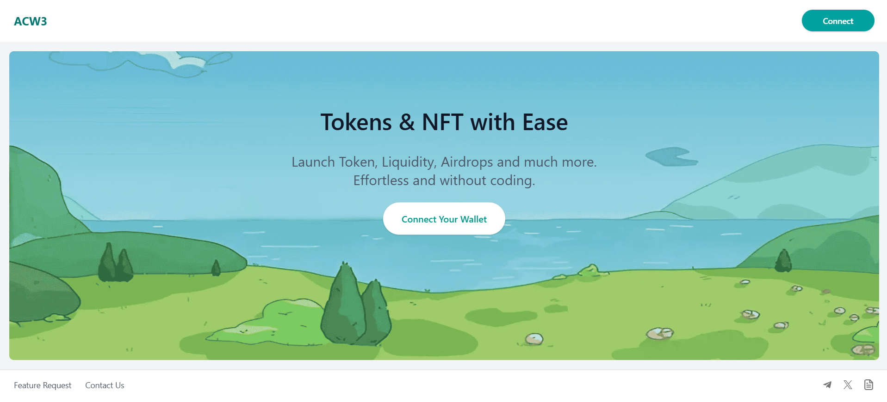

### 🏠 Dashboard

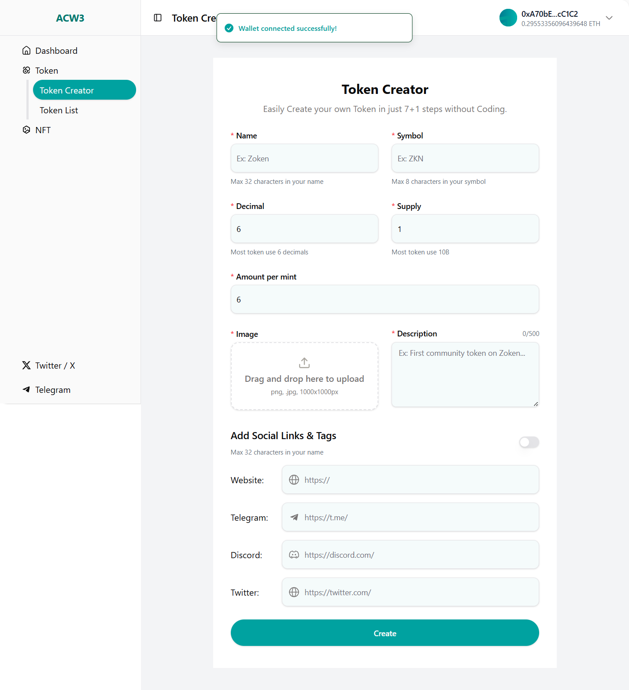

### 📦 Main Feature

#### Create Token UI

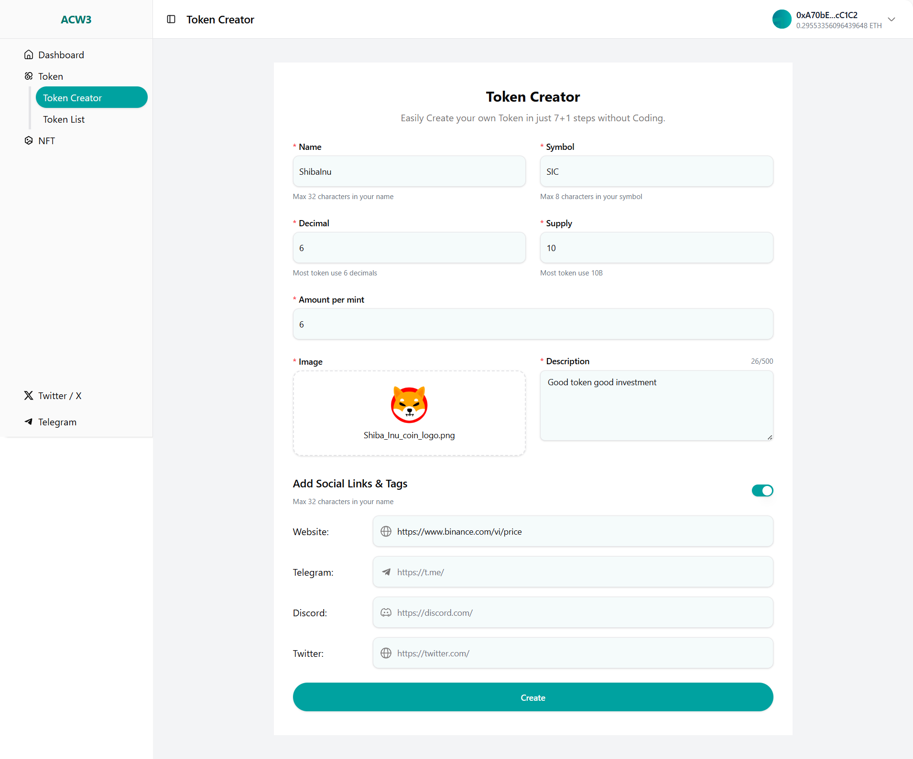

#### Create Token (confirm)

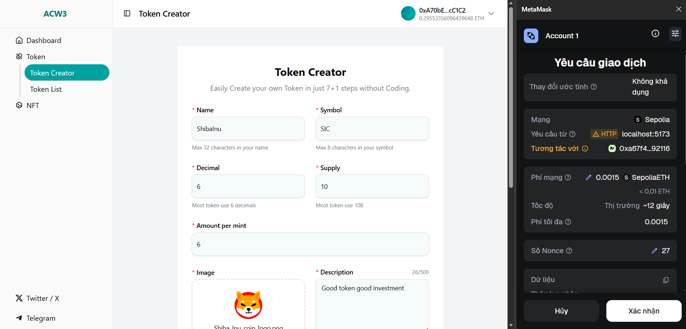

#### Create Token (successfully)

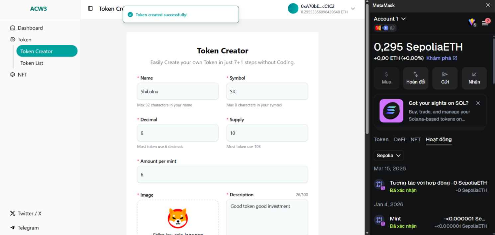

#### Token List

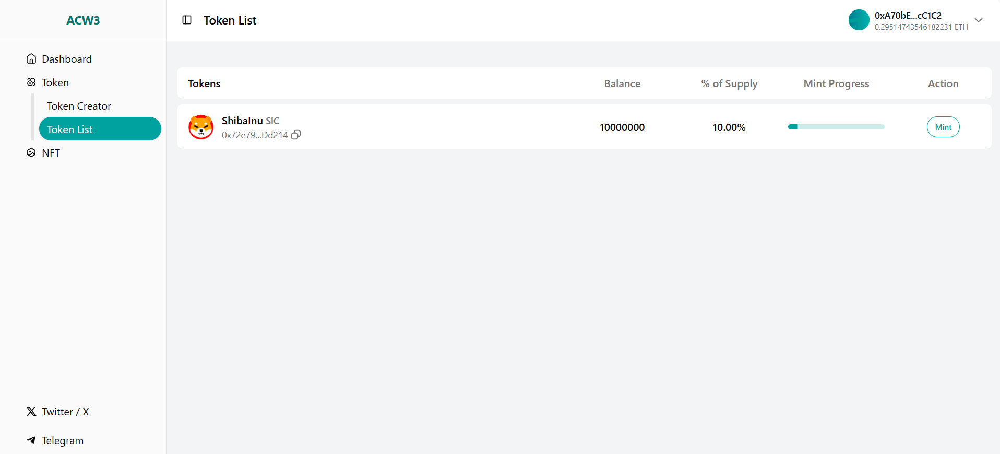

#### Mint Token (step 1)

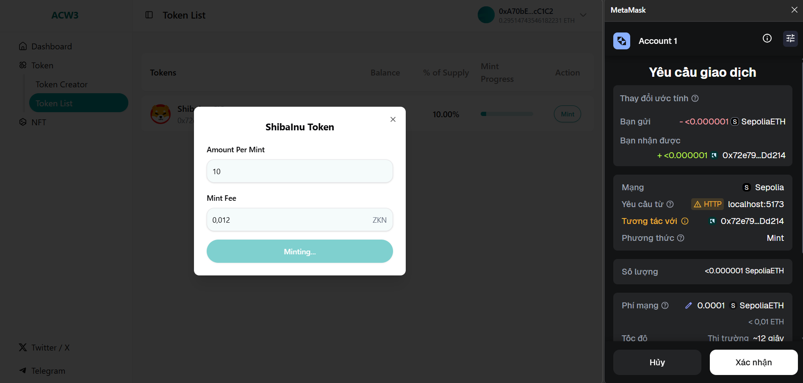

#### Mint Token (step 2)

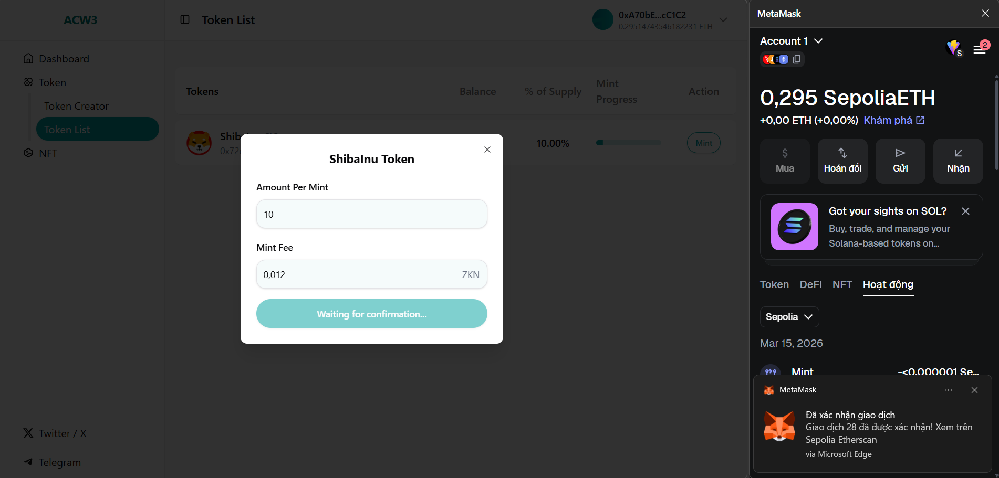

#### Mint Token (step 3)

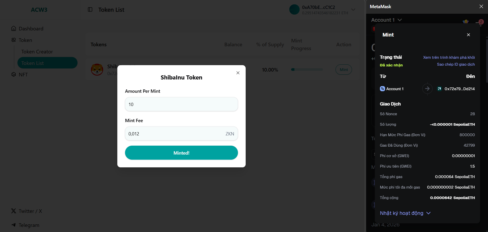

#### Mint Token (successfully)

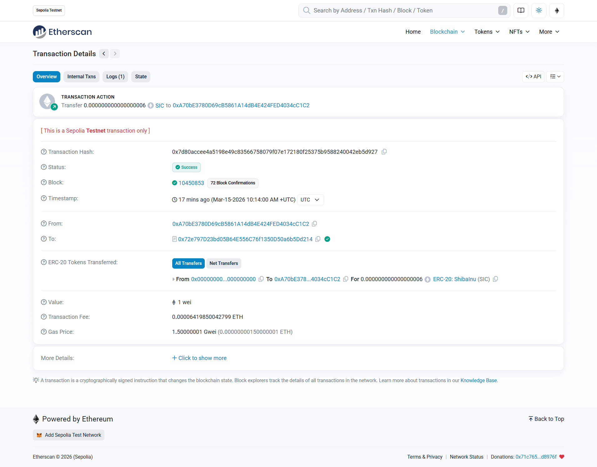

#### Profile

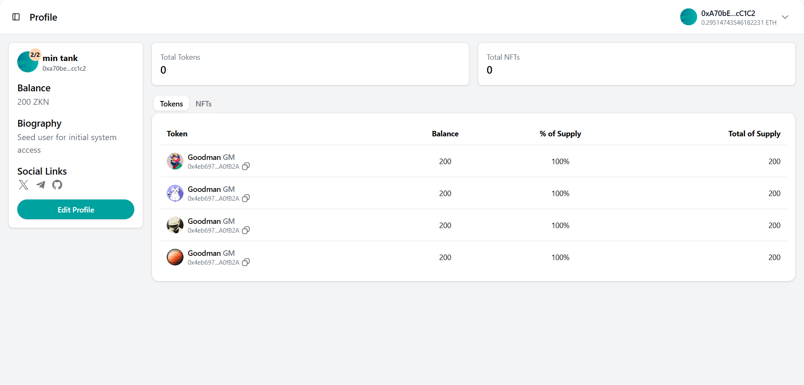

#### Edit Profile

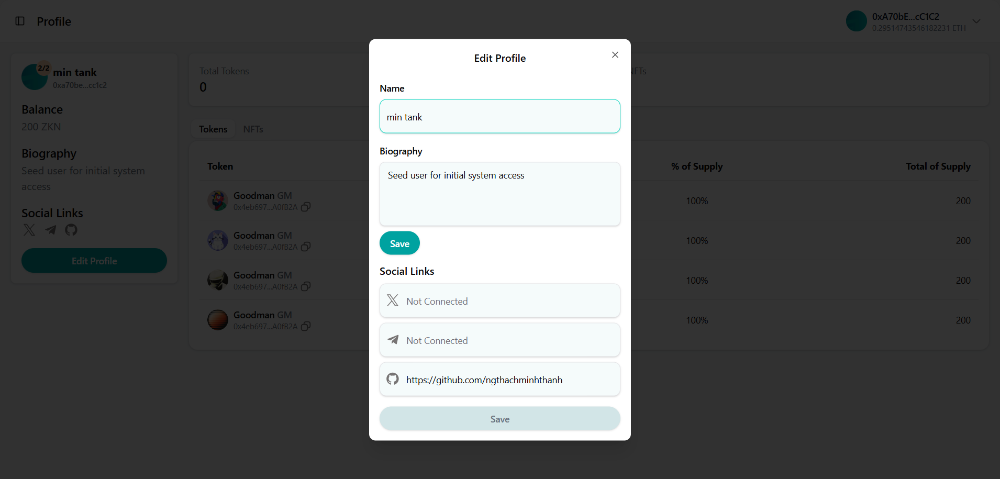

#### Logout

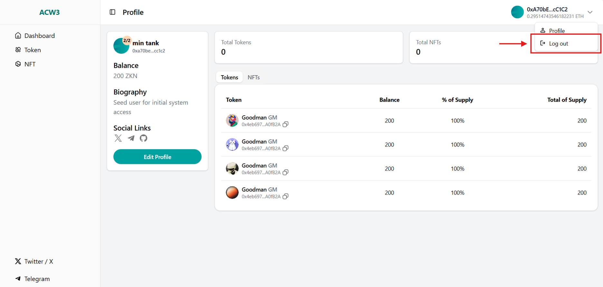

#### Logout (successfully)

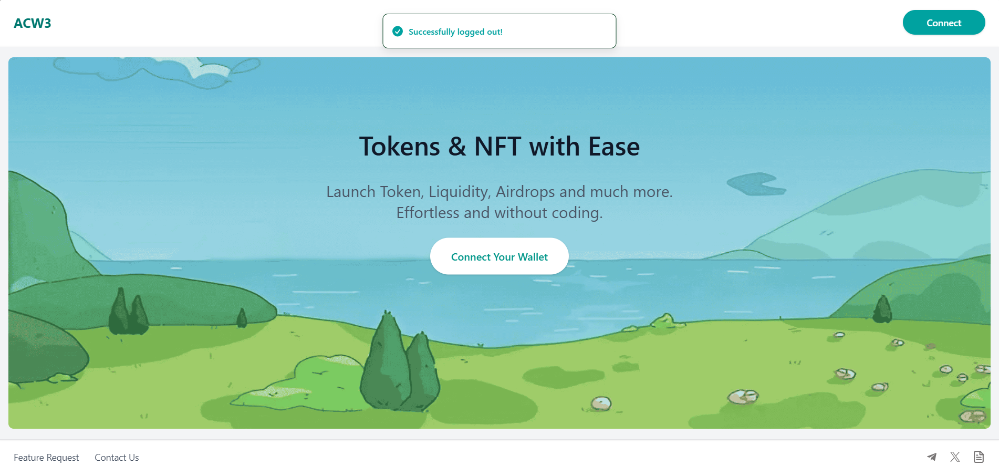

## 🧠 About The Project

This project is a **full-stack decentralized web application** developed as part of my learning and internship journey.

### 🎯 Goals:

- Practice building scalable frontend architecture using React
- Implement RESTful APIs with Node.js
- Apply modern UI/UX design
- Integrate Web3 technologies

### 💡 Highlights:

- Clean architecture (separation between frontend & backend)
- Reusable components and hooks
- Form validation with strong typing
- API state management with React Query

---

## ✨ Main Features

- 🔑 Connect Meta Mask wallet / Authentication (Login / Register with JWT)
- 📄 CRUD operations
- 📡 API integration with Axios
- ⚡ Server state management with React Query
- 🧾 Form validation using React Hook Form + Zod
- 🎨 Modern UI with Tailwind CSS, Radix UI, and shadcn/ui
- 🔔 Toast notifications
- 🔗 Web3 integration (Wagmi, Viem)

---

## 🛠️ Tech Stack

### 🎨 Frontend

- ⚛️ React 19 + Vite
- 🧭 React Router
- 🎯 React Hook Form + Zod
- 🔄 TanStack React Query
- 🎨 Tailwind CSS + Radix UI
- 🔔 Sonner (Toast)
- 🔗 Wagmi + Viem (Web3)

---

### 🚀 Backend

- 🟢 Node.js + Express
- 🔐 JWT Authentication
- 🔑 bcrypt (Password hashing)
- 📦 Multer (File upload)
- 🌐 CORS enabled

---

### 🗄️ Database

- 🍃 MongoDB + Mongoose

---

### ⚙️ Dev Tools

- ⚡ Vite
- 🧹 ESLint
- 🧠 TypeScript
- 🔄 Nodemon

---

## 📂 Folder Structure

```
project-root/
│
├── frontend/ (React + Vite)
│   └── src/
│       ├── abis/         # Smart contract ABIs
│       ├── api/          # API calls & services
│       ├── assets/       # Images & static files
│       ├── components/   # Reusable UI components
│       ├── constants/    # Static values & configs
│       ├── context/      # Global state (React Context)
│       ├── hooks/        # Custom React hooks
│       ├── lib/          # Utility libraries / configs
│       ├── pages/        # Application pages
│       ├── routes/       # Routing configuration
│       ├── types/        # TypeScript types/interfaces
│       └── utils/        # Helper functions
│
├── backend/ (Node.js + Express)
│   └── src/
│       ├── configs/
│       ├── controllers/
│       ├── interfaces/
│       ├── middleware/
│       ├── models/
│       └── routes/
│
├── screenshots/          # Images for README
└── README.md
```

## ⚙️ Installation & Setup

### 1️⃣ Clone repository

```bash
git clone https://github.com/ngthachminhthanh/DApp.git
cd your-repo
```

2️⃣ Setup Frontend

```bash
cd frontend
npm install
npm run dev
```

3️⃣ Setup Backend

```bash
cd backend
npm install
npm run dev
```

🔑 Environment Variables
📌 Backend (.env)

```bash
PORT=5035
MONGO_URI=your_mongodb_connection
JWT_SECRET=your_secret_key
JWT_EXPIRES_IN=1d
```

🚀 Deployment

- Frontend: Vercel

- Backend: Render

🤝 Contributing
Contributions are welcome!

```bash
git checkout -b feature/your-feature
git commit -m "Add new feature"
git push origin feature/your-feature
```

👨‍💻 Author

Nguyen Thach Minh Thanh

- GitHub: https://github.com/ngthachminhthanh/
- Email: ngthachminhthanh@gmail.com

⭐ Support

If you find this project useful, please give it a ⭐ on GitHub!
